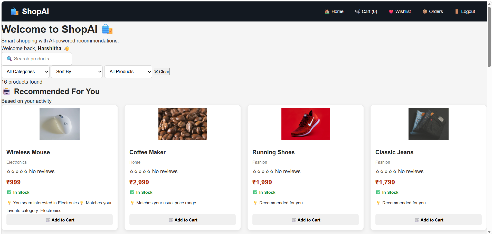

\# 🛒 ShopAI - Smart E-Commerce Platform


ShopAI is a full-stack e-commerce web application with AI-inspired personalized product recommendations.


\## 🚀 Features


\- User Registration and Login

\- JWT Authentication

\- Product Catalog

\- Product Search

\- Category Filtering

\- Price Sorting

\- Stock Filtering

\- Product Details

\- Shopping Cart

\- Wishlist

\- Product Reviews and Ratings

\- Personalized Product Recommendations

\- Order Placement

\- Order History

\- Cash on Delivery

\- Online Payment option

\- MongoDB Database

\- Responsive Frontend


\## 🤖 Recommendation System


ShopAI recommends products based on:


\- User activity

\- Viewed products

\- Cart activity

\- Purchase history

\- Product categories

\- Product ratings

\- Product stock availability


The system also provides recommendation reasons and recommendation scores.


\## 🛠️ Technologies Used


\### Frontend

\- HTML

\- CSS

\- JavaScript

\- Vite


\### Backend

\- Node.js

\- Express.js

\- MongoDB

\- Mongoose

\- JWT

\- bcryptjs

\- CORS


\## 📁 Project Structure


```text

ShopAI/

│

├── backend/

│   ├── middleware/

│   ├── models/

│   ├── routes/

│   ├── seedProducts.js

│   ├── server.js

│   ├── package.json

│   └── .env.example

│

├── frontend/

│   ├── public/

│   ├── src/

│   ├── index.html

│   └── package.json

│

├── .gitignore

└── README.md


## 📸 Screenshots

### 🏠 Home Page


